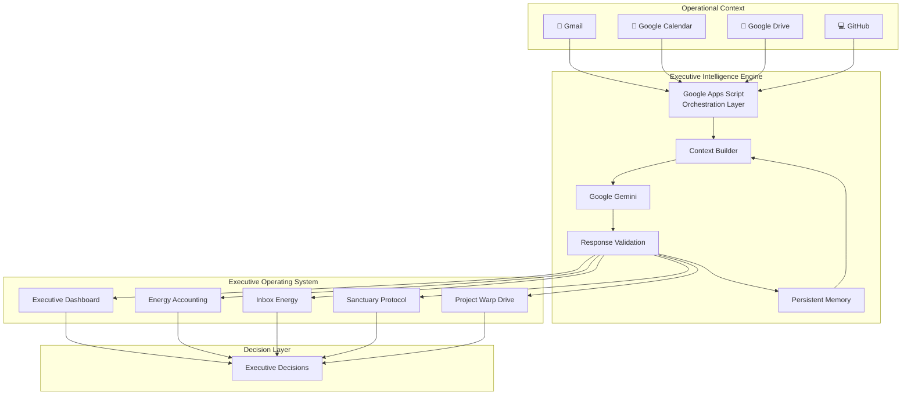
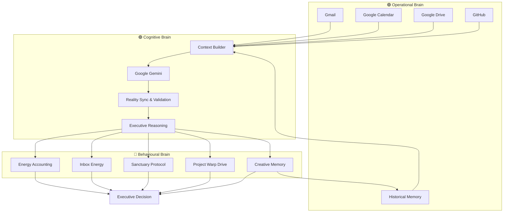
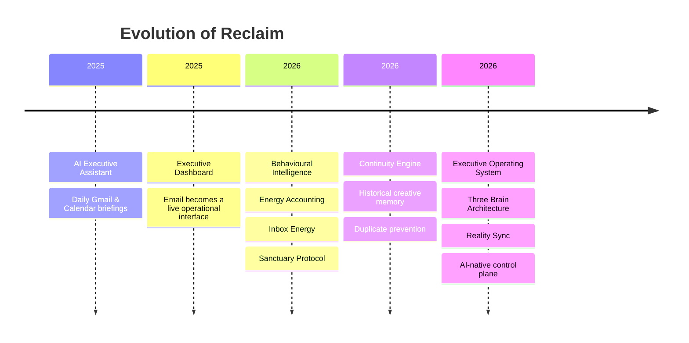

# Reclaim

## An AI-Native Executive Operating System for Founders Who Forget How to Switching Off

> *Technology should not only help us work harder. It should help us know when to stop.*

<div align="center">


</div>

> [!IMPORTANT]
> **Repository Notice**
>
> This repository documents the architecture, engineering decisions and behavioural design behind **Reclaim**.
>
> The production source code remains private because it contains proprietary business logic, authentication workflows and security-sensitive automation.
>
> The purpose of this repository is to demonstrate **how the system was designed**, rather than expose its commercial implementation.

<p align="center">
  
</p>


## Why Reclaim Exists

Reclaim began as a personal engineering project rather than a commercial product. At the end of 2025 I had already built an AI Executive Assistant that summarised my Gmail, Google Calendar and daily priorities into a single executive briefing every morning while also giving me suggestions of what to work on and block the time on my calendar before I'd even woke up. It worked exactly as intended, but after a few weeks I realised that having more information wasn't changing my behaviour.

I was regularly coding until three or four o'clock in the morning because once I had an idea I simply didn't stop until it was finished. The projects were moving forward faster than ever, but everything surrounding them was quietly deteriorating. The house became increasingly neglected, takeaways replaced proper meals because they were quicker than cooking, the school run became my only form of exercise, and self-care slowly became something I'd "get around to tomorrow".

The problem wasn't productivity. If anything, I was too productive. The problem was that every email, every notification and every idea felt equally important, so there was never a natural point to stop working. Ironically, the AI Executive Assistant I had built knew everything I needed to do each day, yet it had no understanding of whether I had the physical or mental capacity to do it.

Reclaim was created to solve that problem. Rather than becoming another productivity dashboard, it evolved into an executive operating system that combines operational context, behavioural intelligence and persistent AI memory to help founders make better decisions about both their work and themselves. Its purpose is not to maximise output at any cost, but to create a sustainable way of building ambitious software without sacrificing the human being behind it.


<p align="center">
  
</p>

# The Problem

Modern productivity software assumes that if you organise work more efficiently, everything else will naturally fall into place.

In reality, the opposite can happen.

The more efficient I became, the more work I found myself creating. Every new automation unlocked another idea. Every completed project led to another opportunity. Every spare hour became another opportunity to build something.

By the end of 2025 I had unintentionally built a lifestyle where my business was thriving, but the systems supporting me were not.

My AI Executive Assistant knew exactly what was in my inbox. It knew my calendar, my priorities and my deadlines. It could summarise my day in seconds, yet it couldn't recognise that I hadn't drunk enough water, eaten a proper meal or stepped away from my desk in twelve hours.

The issue wasn't information.

It wasn't organisation.

It wasn't time management.

It was context.

Traditional productivity tools optimise tasks. They don't understand the human performing them. Every notification appears equally important, every email demands attention and every unfinished idea competes for the same mental bandwidth. The result is a constant state of cognitive load where stopping work feels more difficult than continuing.

For founders, developers and creators who genuinely enjoy building, this becomes particularly dangerous. Work rarely feels like work, so there is no natural point to stop. One feature becomes another, one bug fix becomes a refactor, and before long the evening has disappeared.

Reclaim was designed to solve that specific problem.

Rather than becoming another task manager, calendar application or AI assistant, it became an executive operating system that continuously balances operational priorities against the user's available energy, recovery and long-term sustainability.

Its purpose is simple.

To build ambitious things without allowing the act of building to quietly consume everything else.

<p align="center">
  
</p>

# Design Philosophy

Every feature in Reclaim exists because it supports a single objective: helping founders build sustainably without sacrificing the systems that support their work.

The platform was never intended to become another productivity application. Productivity, by itself, is not the goal. More completed tasks are meaningless if they come at the expense of health, relationships or long-term creativity.

Instead, Reclaim is built around five guiding principles that influence every engineering decision throughout the platform.

## 1. Context Over Notifications

Most software reacts to individual events.

An email arrives.

A meeting starts.

A task becomes overdue.

Each event demands attention in isolation.

Reclaim treats those events as part of a wider operational picture. Rather than responding to notifications individually, it combines signals from Gmail, Google Calendar, Google Drive, GitHub and historical behaviour to understand the context surrounding a decision before presenting it to the user.

The objective is to reduce cognitive noise, not increase it.

<p align="center">    </p>

## 2. Behaviour Over Productivity

Traditional productivity software measures output.

Reclaim measures sustainability.

The platform continuously asks a different question:

> *"Is this helping you continue building tomorrow?"*

Features such as Sanctuary Protocol, Inbox Energy and Energy Accounting were designed to protect long-term performance rather than maximise today's task count.

<p align="center">    </p>

## 3. AI Supports Judgement

Artificial intelligence should augment decision making rather than replace it.

Reclaim never attempts to automate important personal decisions. Instead, it provides context, recommendations and behavioural insights while leaving the final decision entirely with the user.

The goal is not autonomous execution.

The goal is better judgement.

<p align="center">    </p>

## 4. Resilience Before Intelligence

Generative AI is powerful, but it is not perfectly reliable.

Every AI response is treated as potentially incomplete, malformed or unavailable.

For that reason, Reclaim prioritises graceful degradation, defensive rendering and deterministic fallback behaviour before introducing additional intelligence.

If an AI service becomes unavailable, the operating system continues functioning using verified operational data.

Reliability is considered a feature rather than an implementation detail.

<p align="center">    </p>

## 5. Memory Creates Better Decisions

Most AI conversations disappear the moment they are finished.

Reclaim deliberately remembers.

Creative ideas, strategic thinking and historical context are preserved within a structured knowledge archive, allowing future interactions to build upon previous work rather than starting from a blank page every day.

The objective is not simply to generate better responses.

It is to create better continuity.

These principles define how Reclaim behaves.

The next chapter explores how they are implemented through a layered architecture that separates operational context, executive intelligence and persistent memory.

<p align="center">
  
</p>

# System Architecture

Reclaim is designed as a layered operating system rather than a traditional web application.

Each layer has a single responsibility, allowing operational data, AI reasoning and presentation logic to evolve independently without tightly coupling the platform to a single technology or AI provider.

This separation also improves resilience. If one service becomes unavailable, the remaining layers continue operating using verified data and deterministic fallbacks.

The architecture consists of four primary layers.



## Layer One - Operational Context

The first layer is responsible for collecting factual information from the systems that already exist.

Rather than asking the user to duplicate information inside another application, Reclaim reads operational context directly from Google Workspace and GitHub. Calendar events, inbox activity, repository health and historical content become the raw material used throughout the platform.

At this stage, no AI interpretation has taken place. The objective is simply to establish an accurate picture of reality.

<p align="center">    </p>

## Layer Two - Executive Intelligence

The orchestration layer is implemented using Google Apps Script.

This layer acts as the brain of the platform, coordinating requests between Google Workspace, GitHub, Gemini and the dashboard without exposing credentials or business logic to the browser.

Its responsibilities include:

- Collecting operational context.
- Constructing structured prompts.
- Validating AI responses.
- Applying defensive fallbacks.
- Maintaining historical memory.
- Returning deterministic JSON to the frontend.

Because every external service passes through this layer, the frontend remains lightweight while the orchestration logic remains centralised and secure.

<p align="center">    </p>

## Layer Three - Executive Operating System

The React application is intentionally treated as a presentation layer rather than the application's brain.

Its responsibility is to visualise operational intelligence through specialised modules such as:

- Executive Dashboard
- Inbox Energy
- Sanctuary Protocol
- Energy Accounting
- Project Warp Drive

Each module focuses on a single aspect of executive decision making while sharing the same validated data source.

This modular design allows individual components to evolve independently without affecting the wider system.

<p align="center">    </p>

## Layer Four - Human Decision Making

The final layer is the only one that cannot be automated.

Reclaim deliberately stops short of making decisions on behalf of its user.

Instead, it provides structured context, behavioural insight and operational awareness that support better judgement without removing human agency.

The goal is not autonomous execution.

The goal is consistently better decisions.

> [!NOTE]
> One of the defining characteristics of Reclaim is that the user remains the operating system's final authority. Artificial intelligence provides context, not control.


<p align="center">
  
</p>

# Three Brains. One Operating System.

Reclaim is built around three independent intelligence layers, each responsible for solving a different problem.

Rather than treating artificial intelligence as a single feature, the platform separates operational awareness, cognitive reasoning and behavioural guidance into dedicated systems that work together to support better executive decision making.

This architecture keeps each layer focused, resilient and independently replaceable while allowing information to flow naturally throughout the platform.



## 🟢 Operational Brain

The Operational Brain observes reality.

It has no opinions and makes no assumptions. Its only responsibility is to collect reliable information from the systems that already exist. Gmail, Google Calendar, Google Drive, GitHub and historical archives become a continuously updated picture of the current operating environment.

This layer deliberately avoids AI interpretation. It answers one question only:

> **What is happening?**

<p align="center">    </p>

## 🟣 Cognitive Brain

The Cognitive Brain interprets reality.

Implemented through Google Apps Script and Google Gemini, this layer transforms operational context into structured executive intelligence. Rather than forwarding raw data to the frontend, it validates AI responses, repairs malformed structures, applies deterministic fallbacks and produces predictable JSON contracts that every component can trust.

It also maintains Reclaim's long-term memory by reviewing historical outputs before generating new ones, reducing repetition and allowing ideas to evolve over time.

This layer answers the question:

> **What does it mean?**

<p align="center">    </p>

## 🩷 Behavioural Brain

Knowing something doesn't automatically change behaviour.

The Behavioural Brain exists to close that gap.

Instead of presenting information as dashboards and statistics, Reclaim translates executive intelligence into practical actions that protect long-term performance.

Energy Accounting encourages awareness of cognitive load.

Inbox Energy identifies attention rather than volume.

Sanctuary Protocol promotes recovery before exhaustion.

Project Warp Drive keeps software development visible without becoming obsessive.

Creative Memory ensures today's work builds naturally on yesterday's ideas instead of constantly starting from zero.

This layer answers the question:

> **What should I do next?**

<p align="center">    </p>

These three brains create a continuous feedback loop.

Reality becomes understanding.

Understanding becomes action.

Action creates new history.

Tomorrow's decisions are therefore informed not only by today's operational context, but by everything the system has already learned.

<p align="center">
  
</p>

# Engineering Decisions

Every engineering decision within Reclaim exists to support a single objective:

> **Reduce friction without increasing complexity.**

The platform deliberately favours simple, resilient solutions over fashionable architectures. Rather than introducing additional infrastructure for its own sake, each component is evaluated against three questions:

- Does it reduce cognitive load?
- Does it improve resilience?
- Will it still make sense two years from now?

The following sections explain the reasoning behind the most significant design decisions.

<p align="center">    </p>

## AI Is Treated As An Unreliable Collaborator

Large language models are incredibly capable, but they are not deterministic.

Reclaim never assumes an AI response will be available, correctly structured or even valid JSON.

Every response is validated before it reaches the interface. If the payload cannot be trusted, the orchestration layer attempts repair, applies defensive normalisation and, where necessary, replaces AI-generated insight with verified operational data.

The objective is simple.

The dashboard should continue functioning even when the AI does not.

<p align="center">    </p>

## Google Apps Script Is The Brain

Most AI applications communicate directly from the browser to multiple APIs.

Reclaim deliberately avoids that pattern.

Google Apps Script acts as a central orchestration layer between Google Workspace, GitHub, Gemini and the React application. Every request passes through a single intelligence layer responsible for authentication, prompt construction, validation, fallback handling and historical memory.

This approach keeps credentials off the client, centralises business logic and makes the frontend significantly easier to maintain.

<p align="center">    </p>

## Google Sheets As A Knowledge Store

The platform deliberately uses Google Sheets as a structured datastore for operational history and creative memory.

This was not chosen because it was the simplest option.

It was chosen because it was the most practical.

The data is transparent, editable, searchable, versioned and immediately accessible without introducing unnecessary infrastructure.

For the scale and purpose of the project, a spreadsheet provides a faster feedback loop than a traditional database while remaining entirely under the user's control.

<p align="center">    </p>

## The Continuity Engine

Most AI systems forget yesterday.

Reclaim remembers it.

Every successful creative generation is archived before new requests are made. Prior to generating fresh content, the orchestration layer reviews recent history to identify repeated themes, ensuring that new ideas build upon previous work rather than accidentally recreating it.

The result is a lightweight long-term memory system that improves consistency without requiring vector databases, embeddings or external retrieval services.

Context is accumulated naturally through work rather than artificially reconstructed later.

<p align="center">    </p>

## Behaviour Before Metrics

Many productivity applications reward activity.

Reclaim rewards sustainability.

Metrics such as Inbox Energy, Energy Accounting and Sanctuary Protocol exist to influence behaviour rather than simply visualise data.

The objective is not to create another dashboard.

It is to encourage better decisions while reducing the cognitive effort required to make them.

<p align="center">    </p>

## Local-First Resilience

Wherever possible, Reclaim continues operating without requiring constant communication with cloud services.

Local persistence allows recent state, behavioural history and interface context to survive temporary outages while reducing unnecessary API calls.

Operational continuity is considered more valuable than perfect synchronisation.

<p align="center">    </p>

## Privacy By Default

The platform assumes operational information is private.

Authentication credentials remain within the orchestration layer, proprietary business logic never reaches the browser and sensitive Workspace operations are executed server-side.

Only the structured information required to render the interface is transmitted to the client.

Privacy is treated as an architectural principle rather than an optional feature.

<p align="center">    </p>

## Simplicity Wins

Throughout development there were many opportunities to introduce additional technologies.

Dedicated databases.

Vector search.

Complex backend frameworks.

Additional cloud services.

In almost every case they were rejected.

The final architecture deliberately favours straightforward, understandable systems that solve real problems without creating unnecessary operational overhead.

Every dependency should justify its existence.

Every feature should solve a genuine problem.

Every layer should make the system easier to reason about rather than harder.

<p align="center">
  
</p>

## Under the Hood

Although Reclaim presents itself as a single executive operating system, it is composed of multiple independent intelligence modules, each designed to solve a specific behavioural or operational problem.

Rather than creating one large monolithic application, every subsystem has a clearly defined responsibility. This modular architecture allows individual capabilities to evolve independently while contributing to a shared understanding of the user's operational environment.

```text
src/
├── components/
│   ├── DirectorBrief.jsx
│   ├── SanctuaryProtocol.jsx
│   ├── InboxEnergyTracker.jsx
│   ├── CreativeLab.jsx
│   └── ProjectWarpDrive.jsx
│
├── services/
│   ├── api.js
│   ├── github.js
│   ├── gemini.js
│   └── storage.js
│
└── hooks/
    └── useTime.js
```

### DirectorBrief.jsx

Converts the daily AI executive briefing into a live operational view of the day.

### SanctuaryProtocol.jsx

Turns recovery, body maintenance and home reset prompts into practical, low-friction actions.

### InboxEnergyTracker.jsx

Separates inbox activity into energy drains and energy gains so attention is prioritised rather than simply reacting to unread messages.

### CreativeLab.jsx

Generates and preserves content ideas across business branches so strong ideas are not lost when the browser refreshes.

### ProjectWarpDrive.jsx

Provides a visual telemetry layer for active repositories, deployment status and project momentum.

<p align="center">    </p>

## 🧠 Executive Intelligence Engine

The Executive Intelligence Engine acts as the central reasoning layer of the platform.

Operational context collected from Google Workspace and GitHub is transformed into structured executive intelligence through a controlled orchestration pipeline. Rather than sending raw prompts directly to a language model, the system constructs deterministic requests, validates every response and returns predictable data structures to the dashboard.

The result is an AI layer that behaves consistently enough to become part of a production system rather than an experimental feature.

<p align="center">    </p>

## ⚡ Energy Accounting

Productivity is only one side of sustainable performance.

The Energy Accounting module allows daily activities to be recorded as either energy gains or energy drains, creating a behavioural history that reveals patterns often missed during busy periods.

Instead of measuring how much work has been completed, the system measures the cost of completing it.

By identifying recurring sources of cognitive load, Reclaim can recommend practical boundaries before exhaustion becomes the default operating mode.

<p align="center">    </p>

## 📬 Inbox Energy

Traditional email clients treat every unread message equally.

Reclaim does not.

Inbox Energy analyses executive briefing data to distinguish between communication that creates unnecessary cognitive load and communication that genuinely moves work forward.

Rather than encouraging the user to reach Inbox Zero, the objective is to achieve Attention Zero, ensuring that mental energy is reserved for work that genuinely deserves it.

<p align="center">    </p>

## 🏡 Sanctuary Protocol

High performance cannot be separated from the environment in which it happens.

Sanctuary Protocol introduces recovery, home maintenance and personal wellbeing into the same decision-making framework as meetings, projects and deadlines.

Small interventions such as hydration, household resets or nervous system regulation are intentionally treated as operational priorities rather than optional extras.

The purpose is not to create perfect routines.

The purpose is to protect the conditions that make consistent performance possible.

<p align="center">    </p>

## 🚀 Project Warp Drive

Project Warp Drive provides operational awareness across active software projects.

Repository activity, deployment health and development momentum are combined into a single executive overview, allowing engineering effort to be assessed without manually inspecting multiple repositories.

Rather than measuring productivity for its own sake, Warp Drive exists to answer a simple question:

> Which project genuinely needs my attention today?

<p align="center">
  
</p>

## 🧩 Continuity Engine

Unlike most AI systems, Reclaim deliberately remembers.

Every successful creative session is archived into a structured historical knowledge base before new ideas are generated.

Prior to each request, the orchestration layer reviews recent history to reduce repetition, preserve continuity and encourage progressive refinement rather than constant reinvention.

This allows creative work to accumulate naturally over time, creating an evolving body of knowledge rather than a sequence of disconnected conversations.

<p align="center">
  
</p>

## 🛡 Reality Sync

Artificial intelligence is only one source of truth.

If AI services become unavailable or return unusable data, Reclaim automatically falls back to verified operational information collected directly from Google Workspace.

Calendar events remain visible.

Inbox summaries remain available.

Historical context remains intact.

The platform continues operating because reality always takes precedence over interpretation.

<p align="center">
  
</p>

# Evolution of the Platform

Reclaim was never designed as a single application.

Each capability emerged as the solution to a real operational problem, gradually transforming a collection of automations into a unified executive operating system.



### Phase One - Information

The original system generated a daily executive briefing from Gmail, Google Calendar and operational data.

It answered a simple question:

> **What do I need to know today?**

<p align="center">
  
</p>

### Phase Two - Visibility

The daily email eventually became limiting.

Information was transformed into an interactive dashboard capable of presenting operational context throughout the day instead of once each morning.

The question became:

> **What deserves my attention right now?**

<p align="center">
  
</p>

### Phase Three - Behaviour

As the platform matured, a more important observation emerged.

Knowing what needed to be done wasn't changing behaviour.

The system therefore shifted its focus from information to sustainability.

Features such as Energy Accounting, Inbox Energy and Sanctuary Protocol were introduced to protect long-term performance rather than maximise short-term output.

The question became:

> **How do I keep building without burning out?**

<p align="center">
  
</p>

### Phase Four - Continuity

The final stage introduced persistent memory.

Creative output was no longer treated as disposable AI conversations.

Instead, ideas became part of a growing organisational knowledge base that could influence future work.

The operating system stopped reacting to the present.

It began learning from the past.

Today's work now improves tomorrow's decisions.

<p align="center">
  
</p>

# Evolution Through Friction

Reclaim was never designed as a complete operating system.

It evolved through a series of small engineering decisions, each solving a genuine operational frustration encountered during day-to-day work.

Every major subsystem exists because a previous workflow introduced unnecessary friction.


<p align="center">
  
</p>

## Phase One - The Executive Briefing

The project began as a Google Apps Script that generated a daily executive briefing from Gmail, Google Calendar and operational data.

The objective was straightforward: reduce the time spent deciding what to work on each morning.

It answered one question.

> **"What's happening today?"**

<p align="center">
  
</p>

## Phase Two - Don't Lose The Good Ideas

As content generation became part of my daily workflow, a new problem appeared.

Some AI-generated LinkedIn posts were excellent.

Some image prompts were worth keeping.

Some blog ideas deserved revisiting.

If I refreshed the browser or simply forgot to copy something before moving on, it disappeared forever.

The solution wasn't another prompt.

The solution was memory.

Every successful generation began being archived automatically into Google Sheets, creating a searchable knowledge base that could be reused long after the conversation had ended.

What started as a safeguard against losing good ideas became the foundation of Reclaim's Continuity Engine.

<p align="center">
  
</p>

## Phase Three - Build On Yesterday

Once historical content existed, another opportunity emerged.

Rather than asking AI to generate ideas from scratch every morning, why not allow it to learn from previous work?

Before generating new content, the system now reviews recent entries from the creative archive to understand what has already been written.

The result is greater variety, stronger continuity and significantly less repetition across social content, blogs and marketing campaigns.

Instead of beginning every day with an empty page, Reclaim begins with context.

<p align="center">
  
</p>

## Phase Four - Information Isn't Behaviour

Although the AI Executive Assistant successfully summarised my day, I noticed that it wasn't changing how I worked.

I still coded until the early hours of the morning.

I still ignored recovery.

I still treated every notification as equally important.

The platform therefore evolved beyond information management into behavioural support.

Energy Accounting, Inbox Energy and Sanctuary Protocol were introduced to help protect long-term performance rather than simply increase daily output.

<p align="center">
  
</p>

## Phase Five - The Executive Operating System

At some point, the individual automations stopped feeling like separate tools.

They became parts of a single system.

Today, Reclaim combines operational context, executive reasoning, behavioural guidance and long-term memory into a unified operating system designed to help founders build ambitious businesses without losing sight of everything else that matters.

Every feature can be traced back to a real problem.

Every module exists because it solved one.

<p align="center">
  
</p>

# Outcomes

Reclaim was never designed to automate work for the sake of automation.

Every subsystem exists because it reduces friction somewhere within the wider operating environment.

The outcome is not simply a faster workflow.

It is a different way of working.

## Fewer Decisions

By consolidating operational context into a single executive interface, Reclaim removes dozens of small decisions that would otherwise consume attention throughout the day.

Instead of continually asking:

- What should I work on?
- Have I replied to that email?
- Which project needs attention?
- What content have I already written?
- What have I forgotten?

the platform answers those questions before they become interruptions.

The result is more uninterrupted time spent building rather than coordinating.


<p align="center">
  
</p>

## Reduced Cognitive Load

Information alone is rarely the problem.

Modern founders are surrounded by information.

The challenge is deciding which information deserves attention.

By transforming raw operational data into prioritised executive intelligence, Reclaim reduces unnecessary context switching and allows important work to remain visible without overwhelming the user.

<p align="center">
  
</p>

## Sustainable Performance

Many productivity systems optimise for today's output.

Reclaim optimises for tomorrow's capacity.

Behavioural systems such as Energy Accounting, Inbox Energy and Sanctuary Protocol help prevent high performance from becoming self-destructive.

The objective is not simply to achieve more.

It is to remain capable of achieving more over the long term.

<p align="center">
  
</p>

## Organisational Memory

Creative work compounds.

Every article, campaign, idea and strategic insight becomes part of a growing organisational knowledge base rather than disappearing into isolated conversations.

The Continuity Engine allows each new piece of work to build naturally upon previous thinking, creating consistency across weeks, months and years.

<p align="center">
  
</p>

## Executive Clarity

Perhaps the greatest outcome is clarity.

Instead of managing multiple disconnected tools, Reclaim presents a single operational picture that combines reality, reasoning and behaviour into one coherent system.

Technology fades into the background.

Decision making becomes the focus.

<p align="center">
  
</p>

# Architectural Decisions

Technology should solve problems.

It should never become the product.

Every technology used within Reclaim was selected because it supported a specific architectural objective rather than simply following current trends. The platform deliberately favours technologies that reduce operational overhead, improve maintainability and allow the system to evolve without unnecessary complexity.

## React

Reclaim's interface is built using React because the platform behaves as a living operating system rather than a collection of static pages.

Every module responds independently to changing operational context while sharing a common application state. React's component model allows each subsystem to evolve independently without compromising the wider architecture.

The objective was modularity rather than complexity.

<p align="center">
  
</p>

## Vite

Fast iteration was a core requirement throughout development.

Because Reclaim evolved continuously as new operational problems were discovered, rapid build times and immediate feedback significantly reduced development friction.

Vite provides a lightweight development experience that encourages experimentation without introducing unnecessary build complexity.

<p align="center">
  
</p>

## Google Apps Script

Google Apps Script is the architectural centre of the platform.

Rather than exposing credentials, business logic and multiple third-party integrations to the browser, the entire orchestration layer is centralised inside Apps Script.

This middleware coordinates Gmail, Google Calendar, Google Drive, GitHub and Google Gemini while handling authentication, validation, structured prompting, historical memory and deterministic fallbacks.

Separating orchestration from presentation allows the React application to remain focused entirely on user experience.

<p align="center">
  
</p>

## Google Workspace

The platform deliberately integrates with tools that already contain the user's operational context.

Instead of requiring duplicate data entry, Reclaim reads directly from Gmail, Calendar and Drive, allowing existing workflows to become part of the operating system without changing how the user works.

The goal is integration rather than replacement.

<p align="center">
  
</p>

## Google Gemini

Generative AI is used as an executive reasoning engine rather than a content generator.

Operational context is transformed into structured recommendations, behavioural observations and executive briefings that support decision making throughout the day.

Importantly, AI remains only one layer within the system.

Every response is validated before entering the application and can be replaced by verified operational data if required.

<p align="center">
  
</p>

## Google Sheets

Google Sheets serves as both Reclaim's operational datastore and its Continuity Engine. Executive briefings, behavioural observations and creative output are preserved within a structured archive that remains transparent, searchable and entirely under the user's control. Rather than introducing a traditional database simply because it would appear more sophisticated, the architecture prioritises visibility, ownership and maintainability, recognising that the most appropriate technology is not always the most complex one.

<p align="center">
  
</p>

## GitHub

GitHub forms part of the platform's operational awareness rather than acting solely as source control.

Repository activity, deployment status and development momentum contribute to the wider understanding of executive workload, allowing software projects to be evaluated alongside every other operational responsibility.


<p align="center">
  
</p>

## Framer Motion

Motion is used to communicate state rather than decoration.

Subtle transitions reinforce changing operational context, highlight important behavioural shifts and reduce cognitive friction as information updates throughout the interface.

Animations exist to improve understanding rather than attract attention.

<p align="center">
  
</p>

## Vercel

Reclaim is deployed using Vercel to provide a reliable, low-maintenance hosting platform that aligns with the project's overall architectural philosophy.

Infrastructure should remain almost invisible, allowing development effort to focus on solving operational problems rather than maintaining servers.

<p align="center">
  
</p>

## The Bigger Picture

No individual technology defines Reclaim. The platform derives its value from the way each technology contributes to a wider architectural pattern rather than the capabilities of any single framework. Google Workspace provides operational context, Google Apps Script orchestrates intelligence, Gemini performs executive reasoning, Google Sheets preserves continuity, and React transforms that intelligence into an interface that supports better decision making. Individually these technologies are well understood. Their value comes from how they have been combined to solve a human problem rather than a technical one.

Together they create an operating system that helps founders make better decisions while protecting the person making them.

<p align="center">
  
</p>

# Lessons Learned

Reclaim has reinforced an idea that has become increasingly consistent throughout my work: the most effective systems are rarely those with the most technology. They are the ones that remove the greatest amount of friction while remaining understandable, maintainable and resilient over time.

One of the earliest lessons was that more information does not automatically produce better decisions. The original AI Executive Assistant generated comprehensive daily briefings, yet it did little to change my behaviour because it lacked context. Reclaim shifted the focus away from information delivery and towards behavioural guidance, recognising that sustainable performance depends as much on energy and attention as it does on productivity.

Another important lesson was that artificial intelligence should be treated as an enhancement rather than a dependency. Large language models are exceptionally capable, but they remain probabilistic systems. Designing around that reality led to the development of deterministic validation, structured response contracts and Reality Sync, ensuring the platform remains operational even when AI services become unavailable or produce unexpected results.

The project also challenged assumptions about data storage. Conventional software architecture often favours databases by default, yet many of Reclaim's requirements were better served by Google Sheets. The ability to inspect, edit and understand operational data directly proved more valuable than introducing additional infrastructure, reinforcing the belief that the best technical solution is not always the most technically sophisticated one.

Perhaps the most significant lesson, however, had nothing to do with software. Reclaim began as an attempt to organise work more effectively but ultimately became an exercise in protecting the person doing the work. Every major subsystem, from Energy Accounting and Sanctuary Protocol to the Continuity Engine, exists because it solved a genuine problem experienced during the development of the platform itself.

In many ways, Reclaim became an unexpected reminder that architecture is ultimately about people. Technology exists to support human judgement, reduce unnecessary complexity and create space for meaningful work. When software achieves those goals, it quietly disappears into the background, allowing its users to focus on what actually matters.

<p align="center">
  
</p>

# Closing Thoughts

Reclaim began with a simple frustration.

I wasn't struggling to organise my work. I was struggling to stop working.

What started as a daily AI briefing gradually evolved into something much larger. Each new capability solved a genuine problem, and over time those individual solutions became a connected operating system built around a single principle: technology should support the person doing the work, not quietly consume them.

The architecture behind Reclaim reflects the way I approach every software project. Rather than beginning with technologies or frameworks, I begin with operational friction. I look for unnecessary complexity, repetitive decision making and systems that force people to adapt to software instead of allowing software to adapt to people. Only once the problem is clearly understood does the choice of technology become important.

Although the production implementation remains private, the architectural decisions, engineering principles and behavioural design documented throughout this repository accurately represent the way I build commercial software. Every module, every workflow and every integration exists because it solved a real problem and contributed to a system that is more resilient, more maintainable and ultimately more useful.

Reclaim continues to evolve alongside the way I work, but its purpose remains unchanged. It exists to reduce cognitive friction, protect long-term performance and create space for better decisions. If the platform succeeds, it does so quietly. The technology fades into the background, leaving the user free to focus on building the things that matter most.

### Built because I needed it. Shared because someone else probably does too.

Reclaim started as a promise to myself. It became a personal operating system.

Today it represents the way I approach software engineering: understand the human problem first, then build technology that quietly solves it.

If you're looking for someone who designs systems around people rather than forcing people to adapt to software, I'd love to talk.

- Nicola Berry

  
