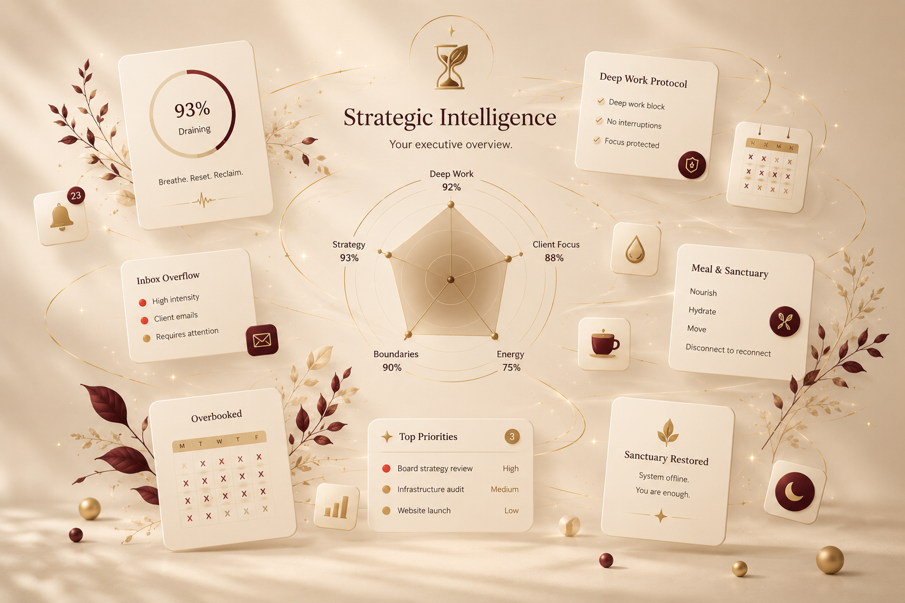
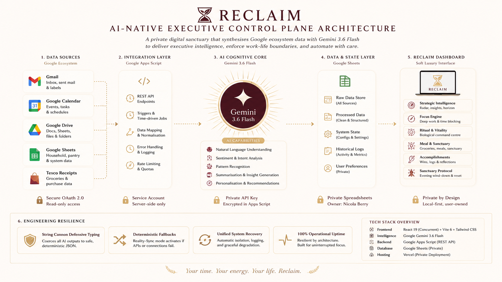
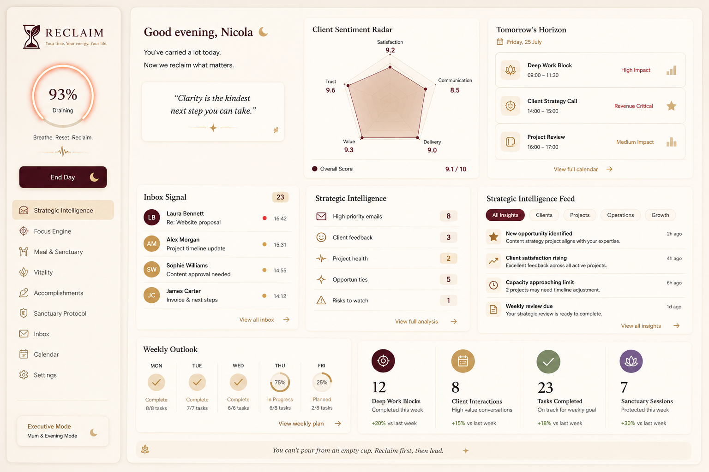
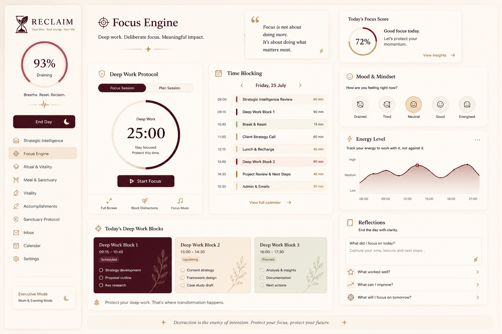
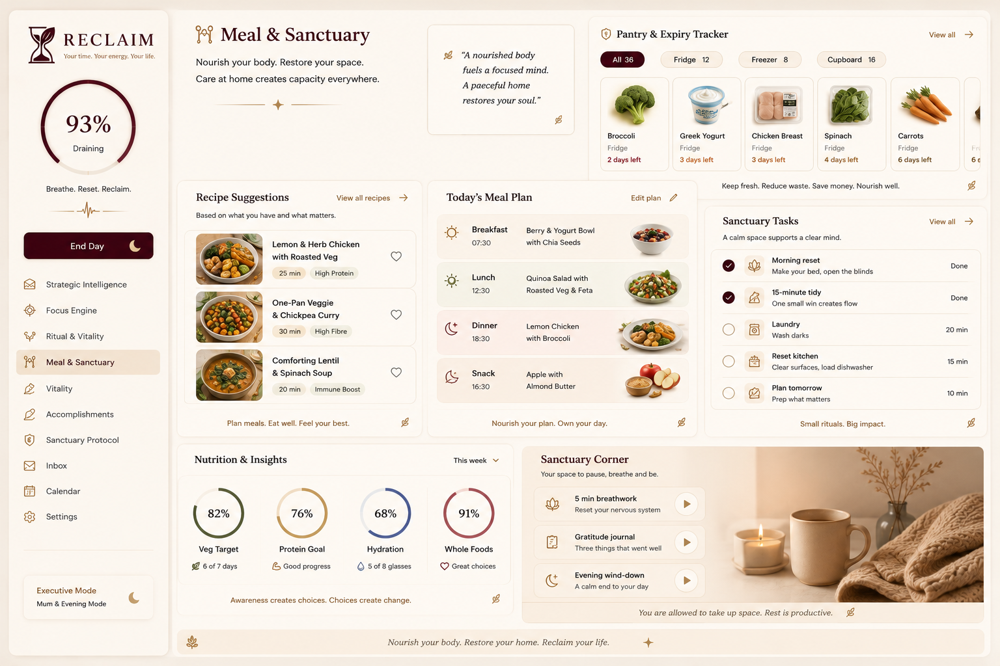
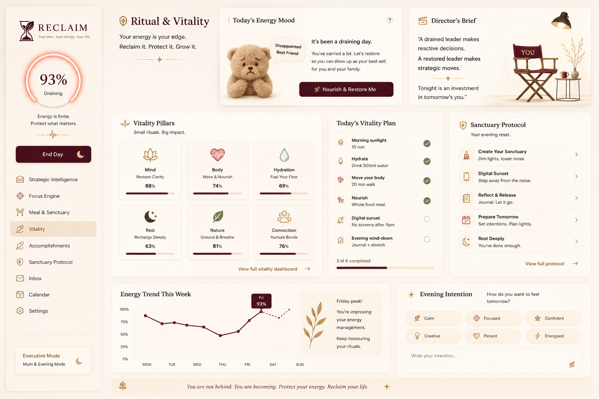

# Reclaim

## An AI-Native Executive Operating System for Founders Who Forget How to Switch Off

> *Technology should not only help us work harder. It should help us know when to stop.*

> [!IMPORTANT]
> **Repository Notice**
>
> This repository documents the architecture, engineering decisions and behavioural design behind Reclaim. The production source code remains private because it contains proprietary business logic, authentication workflows and security-sensitive automation.

  

## What Is Reclaim?

Reclaim is a personal executive operating system that combines operational context, AI reasoning, behavioural intelligence and long-term memory. It brings together information from Gmail, Google Calendar, Google Drive, GitHub and other connected services, then transforms that information into a structured view of what deserves attention, what can wait and when it is time to stop.

Unlike conventional productivity software, Reclaim is not designed to maximise output at any cost. It is designed to help ambitious founders, developers and creators build sustainably without allowing their work to consume the health, relationships, routines and environments that support it.

  

## Why I Built It

Reclaim began with a practical problem. I was learning more about Google Apps Script and had already developed a script that could read my emails, identify useful information and update my calendar. At the same time, I was experimenting with Gemini scheduled actions to create a detailed plan for my day.

The first version worked surprisingly well. I spent time inside a Gemini conversation establishing the right tone, scope and priorities, and each morning I could ask it to plan my day and add the relevant blocks to my calendar. After confirming the actions, the entire schedule could be organised before I had even lifted my head from the pillow.

Within a month, however, the workflow became less reliable. The long conversation thread was becoming difficult to maintain, and setting up a new scheduled action would have meant recreating the same detailed context from the beginning. More importantly, the workflow exposed a larger issue. I did not simply need help adding appointments to a calendar. I needed structure around my entire day.

Some mornings I opened my laptop and did not know where to begin. On other days, I began working and did not know when to stop. The problem was not a shortage of ideas or tasks. It was decision fatigue, competing priorities and the absence of one reliable system that could consider work, family life, meals, health, household responsibilities and business development together.

I already knew that Apps Script could connect to Gmail and Calendar, and I knew that external APIs could provide information such as local weather. The next question was whether I could add AI reasoning directly into the script. Once that proved possible, the scheduled Gemini conversation was replaced with code that I owned and controlled.

That daily briefing became the first version of Reclaim.

  

## The Original Executive Briefing

The original system generated a detailed HTML email every morning. Rather than presenting a generic task list, it used live context to create a complete operating plan for the day.

The briefing could include calendar commitments, relevant emails, local weather, household routines, health prompts, focused work blocks, family responsibilities, social media content, LinkedIn drafts, blog outlines and strategic reminders. The purpose was to reduce the number of decisions required before meaningful work could begin and to ensure that personal responsibilities were not treated as interruptions to the working day.

The email provided structure, but it also revealed new opportunities. Once the content was being generated consistently, the same information could be passed into other systems rather than remaining trapped inside Gmail.

  

## From Briefing to Connected System

The first connected workflow was a Gmail-to-Calendar script. It identifies relevant scheduling information from emails and writes confirmed events into Google Calendar, reducing the manual steps between receiving information and acting on it.

The next challenge was marketing. Building a portfolio and consistently explaining my work required regular content, but captions, article ideas and image concepts were easily lost across documents and conversations. The executive briefing was expanded to generate social media ideas, LinkedIn posts, blog outlines and visual prompts alongside the operational plan.

A Trello API integration now parses the relevant marketing content from the email and adds it directly to my content board. This keeps captions, image ideas and production tasks together in one place, ready for me to review and create.

Gemini also reads the briefing each day and develops selected ideas into longer website articles. Those drafts are saved back into Google Drive, where they become part of the wider content archive. Because Drive is also one of the systems available to the executive assistant, the material it creates can provide additional context for future briefings.

The result is a continuous feedback loop. The daily plan creates content, the content becomes structured work, completed work becomes organisational memory, and that memory improves future planning.

  

## How the Architecture Works

Reclaim is designed as a layered system rather than a single monolithic application. Each layer has a clear responsibility, allowing the operational data, AI reasoning and user interface to evolve independently.

The first layer collects factual context from the tools already being used. Gmail provides communication and task signals, Calendar provides time commitments, Drive provides documents and historical material, GitHub provides project activity, and external services provide information such as local weather.

Google Apps Script acts as the central orchestration layer. It gathers the relevant information, builds structured prompts, sends controlled requests to Gemini, validates the responses and applies deterministic fallbacks where required. It also manages the movement of information between Gmail, Calendar, Drive, Trello and the Reclaim interface.

The React PWA presents the resulting intelligence through focused modules for planning, communication, wellbeing, household routines, content and software projects. The frontend is deliberately treated as a presentation layer rather than the application’s brain, keeping sensitive logic and credentials away from the browser.

The final layer is human decision making. Reclaim can provide context, recommendations and behavioural prompts, but it does not attempt to remove the user’s authority. The system supports judgement rather than replacing it.

  

## Three Brains, One Operating System

Reclaim separates its intelligence into three distinct but connected layers.

The **Operational Brain** observes what is happening. It collects information from Gmail, Calendar, Drive, GitHub and historical records without attempting to interpret it. Its responsibility is to create an accurate picture of the current operating environment.

The **Cognitive Brain** interprets that information. Apps Script and Gemini transform the raw context into structured executive intelligence, while validation and fallback systems ensure that the application does not depend blindly on generative AI. This layer identifies what the available information means and how the different signals relate to one another.

The **Behavioural Brain** translates that understanding into practical action. It considers energy, attention, recovery, household stability, creative continuity and the next useful step. This is what allows Reclaim to move beyond displaying information and begin supporting better behaviour.

Together, the three layers create a continuous cycle in which reality becomes understanding, understanding becomes action, and action becomes new historical context for the next day.

  

## The Reclaim Interface

The Reclaim PWA turns the original executive email into a live interface that can be used throughout the day. Instead of receiving one static briefing in the morning, the user can return to the operating system as priorities, energy and circumstances change.

### Focus Mode

Focus Mode reduces the visible noise surrounding the working day and highlights the area that deserves attention now. It is designed for the moments when multiple projects, messages and responsibilities are competing for the same mental bandwidth.

### Inbox Energy

Inbox Energy looks beyond unread-message counts and considers the effect that communication has on attention. The aim is not to encourage Inbox Zero, but to distinguish between communication that creates unnecessary cognitive load and communication that genuinely moves work forward.

### Sanctuary Protocol

Sanctuary Protocol places home maintenance, food, hydration, recovery and personal wellbeing inside the same operating framework as projects and deadlines. These activities are treated as part of the infrastructure that supports good work rather than optional extras to address once everything else is complete.

### Ritual and Vitality

Ritual and Vitality provides gentle structure around medication, movement, nourishment and transitions between different parts of the day. The purpose is not to create a rigid routine, but to reduce the effort required to remember the small actions that protect long-term capacity.

### Project Warp Drive

Project Warp Drive brings repository activity, development momentum and project priorities into the same executive view as the rest of the day. This makes it possible to see which project genuinely requires attention without manually reviewing multiple repositories and deployment platforms.

### Continuity Engine

The Continuity Engine preserves previous creative work, strategic thinking and generated content. Instead of beginning every AI interaction from a blank page, the system can review earlier material and allow new ideas to build naturally upon what has already been created.

  

## Key Engineering Decisions

### Google Apps Script as the Control Plane

Google Apps Script sits between the interface, Google Workspace, Gemini and external services. This keeps credentials and proprietary business logic away from the browser while allowing the platform to work directly with the tools that already contain the user’s operational information.

Apps Script was also a practical architectural choice because it reduced the need for additional infrastructure. Authentication, scheduled execution, Workspace access and server-side orchestration could remain within an environment already designed to work with Gmail, Calendar, Drive and Sheets.

### AI as an Unreliable Collaborator

Gemini is treated as a capable but non-deterministic collaborator. Reclaim does not assume that an AI response will always be available, valid or correctly structured.

Every response is checked before it reaches the interface. Where necessary, the orchestration layer can repair malformed structures, apply defensive defaults or fall back to verified operational data. The application should continue to function even when the AI does not.

### Google Sheets and Drive as Organisational Memory

Google Sheets and Google Drive provide a transparent and user-controlled knowledge store for operational history, creative work and generated content. The data can be inspected, edited, searched and reused without requiring a separate administrative interface.

A conventional database could have been introduced, but it would have added complexity without delivering a meaningful advantage for the scale and purpose of this project. The chosen architecture prioritises visibility, ownership and maintainability over technical novelty.

### Behaviour Before Metrics

Reclaim does not reward activity simply because it can be measured. Its modules are designed to influence better decisions around attention, energy and sustainability rather than presenting increasingly detailed productivity statistics.

The value of the system comes from reducing cognitive friction and helping the user make a better next decision, not from producing another dashboard full of numbers.

### Ownership Over SaaS Dependency

Reclaim reflects a wider preference for client-owned infrastructure. The system connects accessible tools through code that remains under the user’s control rather than relying on a growing chain of expensive subscriptions.

The objective is not to reject software-as-a-service entirely. It is to avoid paying repeatedly for disconnected tools when a smaller, more coherent system can be built around the platforms the user already owns and understands.

  

## Technology

| Layer | Technology |
|---|---|
| Frontend | React 19 and Vite 6 |
| Application | Progressive Web App |
| Orchestration | Google Apps Script |
| AI reasoning | Google Gemini |
| Operational context | Gmail, Google Calendar, Google Drive and GitHub |
| Historical memory | Google Sheets and Google Drive |
| External context | Weather API |
| Connected workflows | Gmail, Calendar, Trello API and Drive automation |
| Hosting | Vercel |
| Interface motion | Framer Motion |

  

## Outcomes

Reclaim reduces the friction between knowing what needs to be done and actually beginning. It consolidates disconnected information, removes repeated decisions and creates a clearer view of the day without requiring the user to continually move between email, calendars, documents, repositories and project boards.

It also provides stronger continuity across creative and strategic work. Social posts, article ideas, image prompts and completed drafts become part of an evolving knowledge base instead of disappearing into isolated AI conversations.

Most importantly, Reclaim creates a more sustainable relationship with ambitious work. It recognises that meals, movement, recovery, family responsibilities and the condition of the home environment all affect the ability to think clearly and build consistently.

The most important outcome is not increased productivity. It is improved clarity about what deserves attention, what can wait and when enough has been done for one day.

  

## From Personal Tool to Architectural Pattern

Reclaim was created for a deeply personal reason, but the architecture demonstrates a wider commercial pattern. Many founders and small organisations already possess the information they need across email, calendars, documents, spreadsheets and project platforms. Their problem is not a lack of data. It is that the systems containing that data do not work together.

Reclaim demonstrates how existing operational information can be transformed into a connected, intelligent and user-owned system without replacing every tool or introducing unnecessary infrastructure.

It reflects the wider approach behind my work as a Principal Digital Systems Architect: understand the human and operational problem first, then build technology that quietly solves it.

  

## About the Project

Reclaim was designed and developed by **Nicola Berry**. It demonstrates Google Workspace automation, Apps Script orchestration, AI integration, defensive AI engineering, API architecture, progressive web application development, behavioural systems design and cross-platform workflow automation.

The production implementation remains private, but this repository documents the architecture, design thinking and engineering principles behind the system.

### Built because I needed it. Shared because someone else probably does too.

Reclaim started as a promise to myself. It became a personal operating system.
